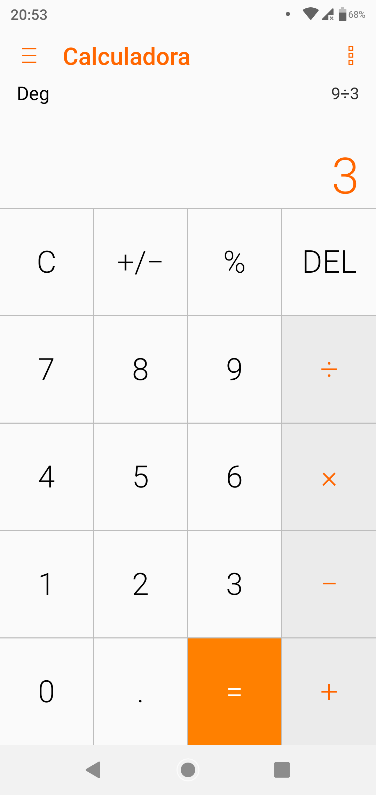
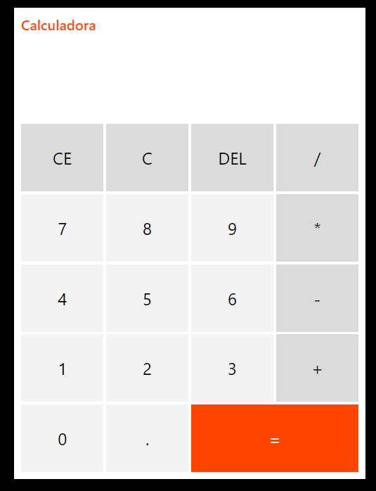

# Projeto Calculadora com HTML/CSS/JAVASCRIPT

Baseada na codificação apresentada nesse vídeo : https://www.youtube.com/watch?v=KCfaPZ2t2yA

Layout CSS baseado na calculadora do meu Zenphone

Comparando: 

Calculadora Zenpohone:

Calculadora Js:

